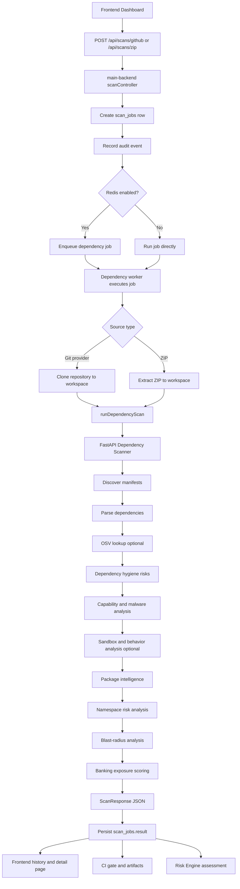

# Dependency Scanner Flow

This document explains the current dependency scanner architecture and how it is integrated with the main backend, frontend dashboard, repository import, ZIP upload, VM agent history, scheduling, CI gate, and risk engine.

## 1. Purpose

The dependency scanner is a FastAPI microservice that analyzes open-source dependencies in a repository or project directory. It does more than basic CVE lookup. It combines:

- Manifest discovery
- Multi-ecosystem dependency parsing
- OSV vulnerability lookup
- Dependency hygiene checks
- Suspicious capability detection
- Static malware fingerprinting
- Optional sandbox and behavior analysis
- Public registry/package intelligence
- Namespace confusion and registry drift detection
- Dependency blast-radius mapping into banking-sensitive code
- Banking exposure scoring
- CI gate decision data
- Artifact integrity metadata
- Data-isolation metadata for bank/private deployments

## 2. High-Level Architecture

```text
Frontend Dashboard
        |
        v
Main Backend API
        |
        |-- GitHub/Git provider import
        |-- ZIP upload extraction
        |-- VM agent adapted results
        |-- Scheduled scan runner
        |
        v
scan_jobs table
        |
        v
Dependency scan dispatcher
        |
        |-- direct in-process execution
        |-- Redis queue worker, when enabled
        |
        v
FastAPI Dependency Scanner
        |
        v
Dependency Scan Result JSON
        |
        |-- stored in scan_jobs.result
        |-- streamed to frontend logs
        |-- used by CI gate endpoint
        |-- used by risk engine
        |-- optionally emailed
        v
Risk Engine / Reports / Dashboard
```

## 3. Runtime Services

| Layer | Path | Responsibility |
| --- | --- | --- |
| Main backend controller | `main-backend/controllers/scanController.js` | Creates dependency scan jobs, handles GitHub/ZIP requests, dispatches execution, streams logs, exposes scan artifacts and CI gate. |
| Main backend scanner client | `main-backend/services/dependencyScannerService.js` | Calls the dependency scanner FastAPI service with `project_path`, policy options, and optional scanner API token. |
| Dependency scanner API | `dependency-Scanner/app/routers/scans.py` | Exposes `POST /api/v1/scans` and maps request payloads to `DependencyScanner.scan()`. |
| Core scanner | `dependency-Scanner/app/services/scanner.py` | Orchestrates manifest discovery, parsing, OSV lookup, static analysis, blast radius, scoring, and final response assembly. |
| Data models | `dependency-Scanner/app/schemas/scan.py` | Defines request, dependency, finding, risk chain, summary, artifact, sandbox, and response schemas. |

## 4. Main Backend Entry Points

### 4.1 GitHub / Git Provider Scan

Endpoint:

```text
POST /api/scans/github
```

Main backend flow:

```text
request body
  repoCloneUrl
  repoFullName
  githubSession
  includeDev
  useOsv
  failOn
  importedRepositoryId
        |
        v
create scan_jobs row with scannerType = dependency
        |
        v
record audit event: scan.created
        |
        v
return 202 response to frontend
        |
        v
dispatch dependency job
        |
        |-- Redis queue if enabled
        |-- direct _runJob otherwise
```

During execution:

```text
resolve Git/provider token
        |
        v
clone repository into isolated workspace
        |
        v
call dependency scanner FastAPI service
        |
        v
store completed result in scan_jobs.result
```

### 4.2 ZIP Upload Scan

Endpoint:

```text
POST /api/scans/zip
```

Main backend flow:

```text
multipart repoZip upload
        |
        v
create scan_jobs row
        |
        v
extract ZIP into isolated workspace
        |
        v
call dependency scanner FastAPI service
        |
        v
store result in scan_jobs.result
```

### 4.3 VM Agent Dependency Results

The dependency scanner page also shows dependency reports produced by VM agents.

```text
GET /api/scans
        |
        v
list normal cloud scan_jobs where scannerType = dependency
        |
        v
list VM agent scan jobs
        |
        v
adapt VM agent dependency module report to dependency scanner job shape
        |
        v
return merged history sorted by createdAt
```

This allows private VM scans and normal repository scans to appear in one dependency scanner history.

## 5. Main Backend Execution Flow

The main backend logs each important stage for the dashboard.

```text
Step 1 - Scan job created
Step 2 - Import repository from Git provider or extract ZIP
Step 3 - Prepare static dependency analysis
Step 4 - Discover dependency manifests
Step 5 - Check vulnerabilities and dependency hygiene
Step 6 - Fingerprint malicious capabilities without CVEs
Step 7 - Check namespace confusion and registry drift
Step 8 - Calculate banking exposure decision
Step 9 - Complete scan and persist result
```

Result persistence:

```text
scan_jobs.status = completed
scan_jobs.result = full dependency ScanResponse
scan_jobs.completedAt = timestamp
```

Failure handling:

```text
sanitize git/token errors
        |
        v
scan_jobs.status = failed
scan_jobs.error = safe error message
scan_jobs.completedAt = timestamp
```

## 6. Main Backend to FastAPI Request

The main backend sends this request through `runDependencyScan()`.

```json
{
  "project_path": "C:/.../workspace/<job-id>/repo",
  "include_dev": true,
  "use_osv": true,
  "fail_on": "high",
  "max_depth": 8
}
```

Optional scanner authentication:

```text
x-scanner-token: <SCANNER_API_TOKEN>
```

FastAPI endpoint:

```text
POST {DEPENDENCY_SCANNER_URL}/api/v1/scans
```

Default URL:

```text
http://127.0.0.1:8001/api/v1/scans
```

## 7. FastAPI Dependency Scanner Internal Flow

Core file:

```text
dependency-Scanner/app/services/scanner.py
```

Flow:

```text
ScanRequest
        |
        v
validate_startup_policy()
        |
        v
_resolve_project_path()
        |
        v
discover_manifests()
        |
        v
build_artifact_metadata()
        |
        v
parse_manifest() for each manifest
        |
        v
OSV vulnerability lookup, if enabled
        |
        v
analyze_dependency_risks()
        |
        v
analyze_capabilities()
        |
        v
scan_static_malware()
        |
        v
run_in_sandbox(), if requested
        |
        v
analyze_behavior()
        |
        v
analyze_package_intelligence()
        |
        v
analyze_namespace_risks()
        |
        v
analyze_blast_radius()
        |
        v
apply_banking_exposure_scores()
        |
        v
_summary()
        |
        v
ScanResponse
```

## 8. Scanner Stages

### 8.1 Startup Policy Validation

Function:

```text
validate_startup_policy()
```

Purpose:

- Enforces scanner runtime safety policies.
- Supports bank/private deployments where scanner startup must be controlled.

### 8.2 Project Path Resolution

Function:

```text
_resolve_project_path()
```

Checks:

- Project path exists.
- Project path is a directory.
- If strict workspace mode is enabled, project path must be inside `SCANNER_WORKSPACE_ROOT`.
- In production, `SCANNER_WORKSPACE_ROOT` is required if strict mode is active.

Why this matters:

- Prevents arbitrary host path scanning in strict deployment.
- Helps banks constrain scanner execution to approved workspaces.

### 8.3 Manifest Discovery

Function:

```text
discover_manifests(project_path, max_depth)
```

Purpose:

- Recursively discovers supported dependency files.
- Respects max depth.
- Avoids scanning unrelated/generated directories.

Supported examples:

| Ecosystem | Manifest examples |
| --- | --- |
| Node.js/npm | `package.json`, `package-lock.json`, `yarn.lock`, `pnpm-lock.yaml` |
| Python/PyPI | `requirements.txt`, `Pipfile.lock`, `poetry.lock`, `pyproject.toml` |
| Java/Maven/Gradle | `pom.xml`, `build.gradle`, `build.gradle.kts` |
| Go | `go.mod`, `go.sum` |
| Rust | `Cargo.toml`, `Cargo.lock` |
| PHP | `composer.json`, `composer.lock` |
| Ruby | `Gemfile`, `Gemfile.lock` |
| .NET/NuGet | `*.csproj`, `*.fsproj`, `packages.config` |
| Docker | `Dockerfile` |

### 8.4 Artifact Integrity Metadata

Function:

```text
build_artifact_metadata(project_path, manifests)
```

Purpose:

- Builds metadata about the scanned source artifact.
- Includes manifest count and integrity information.
- Supports CI gate and audit traceability.

Output is included in:

```text
ScanResponse.artifact
```

### 8.5 Manifest Parsing

Function:

```text
parse_manifest(path, include_dev)
```

Purpose:

- Converts dependency files into normalized `Dependency` objects.

Dependency object:

```json
{
  "name": "jsonwebtoken",
  "version": "8.5.1",
  "ecosystem": "npm",
  "manifest_path": "package.json",
  "scope": "runtime",
  "package_url": null
}
```

The scanner also produces one `ManifestReport` per manifest:

```json
{
  "path": "package.json",
  "type": "package.json",
  "dependency_count": 12
}
```

### 8.6 OSV Vulnerability Lookup

Function:

```text
OSVClient.query()
```

When enabled:

```text
use_osv = true
```

Flow:

```text
deduplicate dependencies
        |
        v
query OSV batch API
        |
        v
convert OSV advisories into VulnerabilityFinding objects
```

Output:

```text
ScanResponse.findings
```

Offline/data isolation:

- Scanner response includes advisory status.
- `data_isolation.externalAdvisoryLookup` tells whether external advisory lookup was used.
- This matters for bank environments where outbound internet may be disabled.

### 8.7 Dependency Hygiene Risk Analysis

Function:

```text
analyze_dependency_risks()
```

Detects:

- Unpinned dependencies.
- Missing lockfiles.
- Weak or broad version ranges.
- Risky npm lifecycle scripts.
- Lockfile integrity concerns.
- Mutable git references.
- Out-of-sync dependency metadata.

Output:

```text
ScanResponse.dependency_risks
```

### 8.8 Capability Analysis

Function:

```text
analyze_capabilities()
```

Detects suspicious behavior patterns without requiring a CVE:

- Shell/process execution.
- Network access.
- Credential/environment access.
- Filesystem access.
- Binary/native behavior.
- Dynamic code execution.

Output:

```text
ScanResponse.capability_findings
```

Why this matters:

- Many real supply-chain attacks do not start as known CVEs.
- This catches capability abuse and malicious behavior indicators earlier.

### 8.9 Static Malware Fingerprinting

Function:

```text
scan_static_malware()
```

Detects:

- Credential exfiltration patterns.
- Suspicious install scripts.
- Obfuscated shell/network behavior.
- Known malicious static patterns.

Output:

```text
ScanResponse.static_malware_findings
ScanResponse.static_malware_status
```

### 8.10 Sandbox and Behavior Analysis

Functions:

```text
run_in_sandbox()
analyze_behavior()
```

Purpose:

- Optional hardened execution path.
- Captures behavior evidence when sandbox execution is requested and available.
- Adds runtime-oriented behavior findings.

Output:

```text
ScanResponse.sandbox
ScanResponse.behavior_findings
ScanResponse.behavior_status
```

If sandbox cannot complete, CI status can fail depending on status.

### 8.11 Package Intelligence

Function:

```text
analyze_package_intelligence()
```

Purpose:

- Adds public registry/package metadata intelligence.
- Detects suspicious ecosystem/package signals.
- Can be disabled or offline depending on bank deployment policy.

Output:

```text
ScanResponse.package_intelligence_findings
ScanResponse.package_intelligence_status
```

### 8.12 Namespace and Registry Risk Analysis

Function:

```text
analyze_namespace_risks()
```

Detects:

- Dependency confusion.
- Public registry fallback for private packages.
- Internal-looking unscoped package names.
- Mutable git dependency references.
- Registry drift/misconfiguration.

Output:

```text
ScanResponse.namespace_risks
```

### 8.13 Blast Radius Analysis

Function:

```text
analyze_blast_radius()
```

Purpose:

- Maps risky/vulnerable dependencies to actual application code usage.
- Finds import/require usage.
- Finds route definitions.
- Finds banking-sensitive contexts such as authentication, crypto, payment, database write, file upload, and token handling.

Output:

```text
ScanResponse.risk_chains
```

Example chain:

```text
Dependency declared in package-lock.json
        |
        v
Known vulnerability matched by OSV
        |
        v
Dependency hygiene risk detected
        |
        v
Imported by application source file
        |
        v
Used near authentication/payment/crypto logic
        |
        v
Prioritized as banking-sensitive blast radius
```

### 8.14 Banking Exposure Scoring

Functions:

```text
apply_banking_exposure_scores()
aggregate_exposure()
```

Purpose:

- Converts dependency risk chains into banking-aware exposure scores.

Score components:

- Exploit likelihood
- Static exploitability
- Business criticality
- Trust deficit
- Malicious capability
- Blast radius

Output:

```text
ScanResponse.summary.banking_exposure_score
ScanResponse.summary.banking_action
RiskChainFinding.exposure
```

Possible banking actions:

| Action | Meaning |
| --- | --- |
| `block` | Stop release or require immediate remediation. |
| `expedite` | Fix urgently before lower-priority issues. |
| `watch` | Track and remediate according to policy. |
| `track` | Low or informational dependency exposure. |

## 9. Summary and CI Gate Logic

Function:

```text
_summary()
```

Summary fields:

```json
{
  "total_manifests": 2,
  "total_dependencies": 168,
  "vulnerable_dependencies": 7,
  "dependency_risk_findings": 12,
  "risk_chains": 8,
  "capability_findings": 4,
  "namespace_risks": 1,
  "banking_exposure_score": 87,
  "banking_action": "block",
  "findings_by_severity": {
    "critical": 1,
    "high": 6,
    "medium": 10,
    "low": 2,
    "unknown": 0
  },
  "risk_score": 100,
  "ci_status": "failed",
  "fail_on": "high"
}
```

Risk score formula:

```text
risk_score =
  critical * 25
  + high * 15
  + medium * 8
  + low * 3
  + unknown * 1

Final risk_score is capped at 100.
```

CI status:

```text
ci_status = failed
if any finding/risk/chain severity >= fail_on
or sandbox status indicates a failed requested sandbox run
```

## 10. Full Scan Response Shape

FastAPI returns:

```json
{
  "scan_id": "uuid",
  "project_path": "workspace/job-id/repo",
  "manifests": [],
  "dependencies": [],
  "findings": [],
  "dependency_risks": [],
  "capability_findings": [],
  "static_malware_findings": [],
  "static_malware_status": {},
  "behavior_findings": [],
  "behavior_status": {},
  "package_intelligence_findings": [],
  "package_intelligence_status": {},
  "namespace_risks": [],
  "risk_chains": [],
  "summary": {},
  "artifact": {},
  "sandbox": {},
  "advisory_status": "online_or_offline_status",
  "data_isolation": {
    "offlineMode": false,
    "externalAdvisoryLookup": true,
    "publicRegistryMetadata": true,
    "sourceUpload": false
  }
}
```

## 11. Frontend Integration

Frontend dependency scanner APIs are defined in:

```text
frontend/src/shared/api/client.ts
```

Main functions:

| Function | Backend endpoint | Purpose |
| --- | --- | --- |
| `startGithubScan()` | `POST /api/scans/github` | Start dependency scan from imported Git repository. |
| `uploadZipScan()` | `POST /api/scans/zip` | Start dependency scan from uploaded ZIP. |
| `fetchScanJobs()` | `GET /api/scans` | List dependency scan history, including adapted VM agent dependency results. |
| `fetchJobStatus(jobId)` | `GET /api/scans/:jobId` | Load dependency scan status and result. |
| `getScanLogsUrl(jobId)` | `GET /api/scans/:jobId/logs` | Stream live scan logs with SSE. |

Dashboard behavior:

```text
User imports repo or uploads ZIP
        |
        v
Frontend calls main backend
        |
        v
Main backend returns queued scan job immediately
        |
        v
Frontend shows live execution log via SSE
        |
        v
When status is completed, frontend renders:
  - manifest count
  - dependency count
  - vulnerability findings
  - dependency risks
  - capability findings
  - namespace risks
  - risk chains
  - banking exposure score
  - CI status
```

## 12. Risk Engine Integration

The dependency scanner does not calculate the final platform-wide business risk alone. It returns technical dependency evidence.

Risk engine flow:

```text
dependency scan result stored in scan_jobs.result
        |
        v
risk assessment created with scanJobIds
        |
        v
risk engine loads completed scan_jobs
        |
        v
dependency result is normalized
        |
        v
combined with config, secret, cipher, and/or VM agent results
        |
        v
technical risk + business risk = final risk report
```

The risk engine uses dependency evidence such as:

- CVE/GHSA findings
- package severity
- dependency hygiene risks
- namespace risks
- capability findings
- risk chains
- banking exposure score
- CI status

## 13. Scheduled Scan Integration

Scheduled scan flow:

```text
scheduled_scans row becomes due
        |
        v
scheduledScanService starts scan batch
        |
        v
scanBatchService creates dependency scan job
        |
        v
dependency FastAPI scanner runs normally
        |
        v
result stored in scan_jobs
        |
        v
risk assessment created for scheduled run
        |
        v
optional PDF report email sent after risk assessment
```

Important point:

Scheduled dependency scans use the same `scan_jobs` table and same result format as manual dependency scans, so they appear in the normal dependency scanner history page.

## 14. CI Gate and Artifact Download

Main backend exposes gate and artifact endpoints for dependency scans.

CI gate:

```text
GET /api/scans/:jobId/gate
```

Decision logic:

```text
allowed = summary.ci_status == "passed"
          and summary.banking_action != "block"
```

Response includes:

- `decision`
- `allowed`
- `jobId`
- `artifactDigest`
- `riskScore`
- `bankingAction`
- `findingsBySeverity`

Artifact download:

```text
GET /api/scans/:jobId/artifact/:format
```

Purpose:

- Export dependency scan result in supported report formats.
- Attach to CI/CD or audit evidence.

## 15. Audit and Quarantine Hooks

When a scan is created:

```text
recordAudit(scan.created)
```

When critical dependency evidence is found:

```text
createQuarantine(...)
```

Purpose:

- Create traceable audit events.
- Enable controlled handling of critical/high-risk dependency evidence.
- Support banking governance and incident workflow.

## 16. Data Isolation and Bank Deployment

The dependency scanner response includes:

```json
{
  "data_isolation": {
    "offlineMode": true,
    "externalAdvisoryLookup": false,
    "publicRegistryMetadata": false,
    "sourceUpload": false
  }
}
```

Meaning:

- Source code stays inside the scanned machine/workspace.
- OSV/public registry calls can be disabled for private or air-gapped banks.
- VM agent mode can scan private/on-prem directories without GitHub import.
- Only structured scan results are sent to the main backend.

## 17. Failure and Timeout Boundaries

Main backend scanner timeout:

```text
120 seconds per dependency FastAPI scan request
```

Common failure points:

| Stage | Failure example | Handling |
| --- | --- | --- |
| Git import | Bad token, private repo access failure | Error sanitized and stored on scan job. |
| ZIP extraction | Invalid archive | Job marked failed. |
| FastAPI scanner | Scanner unavailable or timeout | Job marked failed. |
| OSV lookup | Network/API error | ScanError returned by FastAPI scanner. |
| Sandbox | Requested sandbox failed | CI status can fail. |
| Email | SMTP not configured | Scan still completed; email skipped/logged. |

## 18. Mermaid End-to-End Flow



## 19. Key Metrics Produced

| Metric | Source |
| --- | --- |
| Manifests parsed | `summary.total_manifests` |
| Total dependencies | `summary.total_dependencies` |
| Vulnerable dependencies | `summary.vulnerable_dependencies` |
| Dependency hygiene findings | `summary.dependency_risk_findings` |
| Capability findings | `summary.capability_findings` |
| Namespace risks | `summary.namespace_risks` |
| Risk chains found | `summary.risk_chains` |
| Banking exposure score | `summary.banking_exposure_score` |
| Banking action | `summary.banking_action` |
| Overall dependency risk score | `summary.risk_score` |
| CI status | `summary.ci_status` |
| Artifact hash/integrity | `artifact.artifact_sha256`, `artifact.integrity` |
| Advisory/data isolation | `advisory_status`, `data_isolation` |

## 20. Why This Dependency Scanner Is Different

Most dependency scanners stop at known CVEs.

This dependency scanner adds banking-native supply-chain intelligence:

- It detects risky dependencies even when there is no CVE.
- It maps dependency usage to actual application code paths.
- It prioritizes packages used near authentication, crypto, payments, tokens, and database writes.
- It detects namespace confusion and registry trust issues.
- It can include static malware and behavior intelligence.
- It supports offline/private deployments with data-isolation metadata.
- It integrates with CI gates, scheduled scans, VM agent results, audit logs, quarantine hooks, and the unified risk engine.
